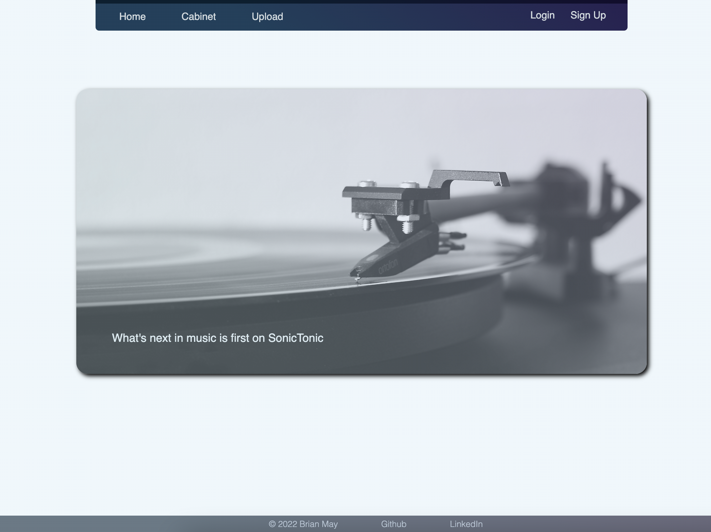
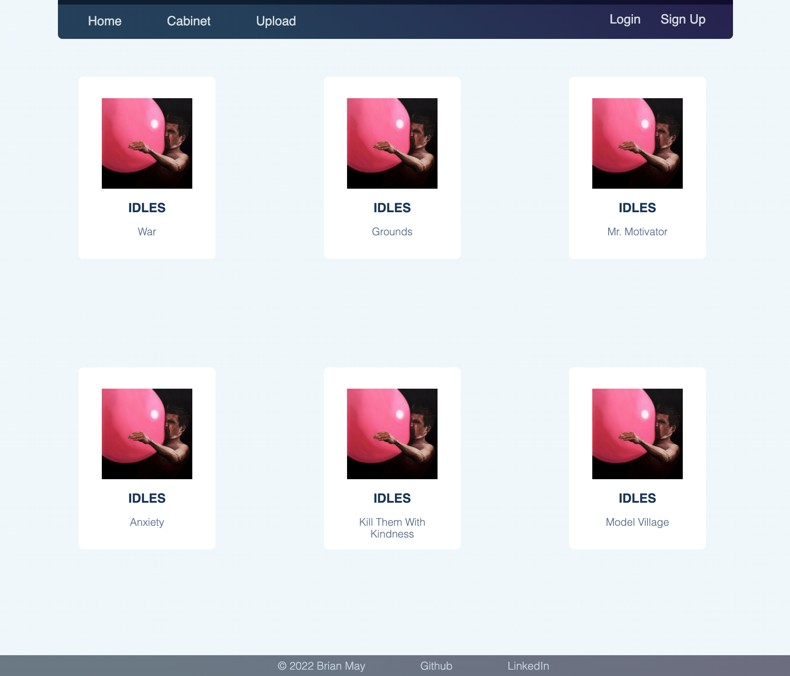
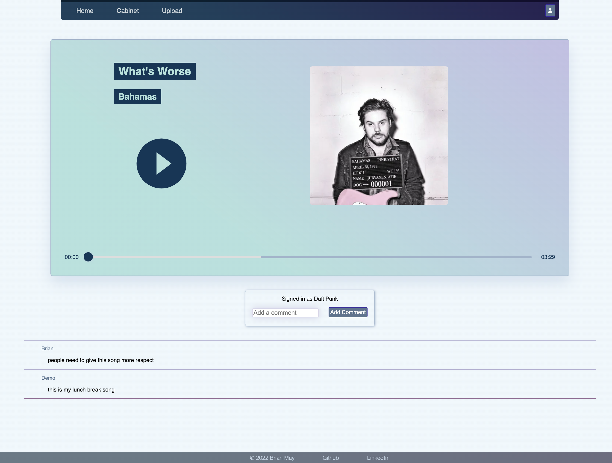

# SonicTonic

## SonicTonic at a Glance

SonicTonic is a full stack application that allows user to explore new music. When signing up, the username chosen will double as the display name.Users are not required to sign up for an account if they just want to listen to music and read comments. Logged in users can add comments to or delete comments from songs on the app, they can also add their own song to the app, with the ability to edit and delete. Any song the user shares will be instantly available to anyone accessing the site. Currently SonicTonic is seeded with 5 different albums by various artists to give the feel for the site.  There is a Demo user available to browse the logged in features, and a couple other users used in to fill out seed data for comments.

## <a href='https://sonictonic.herokuapp.com/'>SonicTonic Live Demo </a>

### <a href='https://github.com/brianmay2014/sonictonic/wiki'>Git Wiki</a>
 

**_Home Page_**

**_Cabinet View_** - View all of the songs uploaded to SonicTonic

**_Song Page_** - Every song has it's own dedicated page for listening to and sharing your thoughts about the song.

## Features
- Sign up / login with email or username
- Logged out users can:
    - Browse the cabinet for all songs uploaded to SonicTonic
    - Listen to any song uploaded with the beautiful minimalist player on each song's page
    - View comments on all songs
- Logged in users can: 
    - Upload new songs
    - Edit their uploaded songs titles and/or genres
    - Delete their uploaded songs
    - Comment on any song on the site
    - Delete their own comments on any song

## Getting Development Environment Up And Running
- Git Clone the repo to your local machine (latest main branch repo)
- Install Dependencies:
  - While inside `/backend` Run `npm install`
  - While inside `/frontend` Run `npm install`
- Create a '.env' file that mirrors the '.env.example' file
- Create a user in your local postgreSQL database according to the .env file
- While inside `backend` use the 'npx dotenv sequelize [suffix]' command with each suffix in order: 'create:db', 'db:migrate', 'db:seed:all'
- Start servers:
  - While inside `/backend` Run `npm start`
  - While inside `/frontend` Run `npm start`
- Enjoy

## Application Architecture

SonicTonic is built on React and Redux in the frontend with an Express backend, using PostgreSQL as a database.

## Frontend Overview

SonicTonic depends on backend for queries and routes, but uses the Redux store and React components for a snappy frontend.

 

### Frontend Technologies Used

#### React

Web pages of SonicTonic are rendered using React components. It creates dynamic reusable content, with quick DOM manipulation for fast re-rendering. Used React to build JSX elements.

#### Redux

SonicTonic uses Redux throughout to make limited backend calls for each page, and uses the Redux store to make re-renders snappy after the user adds, updates, or deletes items.

#### CSS

SonicTonic uses CSS to style all of the HTML documents.

#### Javascript

Javascript is used heavily on the frontend with React and Redux to create a responsive app.

 

### Backend Overview

SonicTonic uses an Express server with PostgreSQL database. SonicTonic also implemented features to protect user's password and information.

#### Express.js

The server of SonicTonic is set up with Express JS.

#### Express session

SonicTonic choose to use Express Sessions to create and manage session cookies on users browser.

#### Express Validator

Express Validator is powerful yet simple. SonicTonic makes sure when users are signing up, logging in, and uploading new song, proper values have been inserted.

#### PostgreSQL

SonicTonic relies on PostgreSQL to maintain its relational database.

#### Sequelize

Sequelize makes it easy for SonicTonic to manage and query the database

#### bcrypt

SonicTonic values the security of users' passwords, that is why all of the passwords has been hashed by bcrypt before storing them into the database.

#### CSRF Token

A secure random CSRF token is generated on all forms that users fill in to prevent CSRF attacks.

 

## Challenges and Solutions

- Deleting related tables
  - Cascading of deletions of comments, when deleting a song with comments tied to it.
- Store Issues
  - Initially tried things without normalizing data, after refactoring to normalized data in my store editing and deleting was a total breeze. Using `Object.values` to convert the normalized into an array for mapping helped immensely.
- Backend Routes
  - Updates not saving in the database was solved by a simple `await song.save()`.
  - Maintain the same pull from the data base for rendering, ran into some issues that were solved by ensuring everything was eagerly loaded with the same data
- Undefined on first render
  - Ran into many rendering issues on an initial load. Either used conditional chaining, or before the component was returned had an if statement for the variable causing undefined issues.
- Heroku deployment
  - Got more experience with deployment, especially with database updates. Ran into issues a couple times and just needed my database reset to fix the issue.
- Learned to not only check what my variables were doing but what the status of the state, database was.
- Planning out my routes and wire frames the week before really helped development move quickly
    - I found it very beneficial in the overall flow to create the components in React, get a basic styling finished before moving onto the functionality. I started from the user experience then worked through the full stack's code with the same flow every time which really helped my visualize how the components worked with the database and store more fluently.

## Conclusion and Next Steps

The next step for SonicTonic is to add playlists, likes, search functionality, user profiles and a more robust albums feature. The end goal would be to have a robust platform for people to be able to share and talk about their music.